# Multi-PDF-Ausgabe & Wärmepumpen-Integration - Kernkomponenten der DING App

## 🎯 Multi-PDF-Ausgabe System (Das Herz der App)

### **Übersicht**
Das Multi-PDF-System in `multi_offer_generator.py` (1.256 Zeilen) ist das **zentrale Verkaufstool** der DING App. Es ermöglicht die gleichzeitige Erstellung von **2-20+ individualisierten Angeboten** für verschiedene Firmen mit **automatischer Produktrotation** und **anpassbarer Preisstaffelung**.

### **🏗️ Architektur & Funktionsweise**

#### **Klasse: MultiCompanyOfferGenerator**
```python
class MultiCompanyOfferGenerator:
    """Generator für Multi-Firmen-Angebote - übernimmt Kundendaten aus Projekt"""
    
    def __init__(self):
        self.customer_data = {}
        self.selected_companies = []
        self.offer_settings = {}
        self.products = self.load_all_products()
```

#### **4-Schritt-Workflow:**

**Schritt 1: Kundendatenübernahme**
- **Automatische Übernahme** aus `st.session_state["project_data"]`
- **Intelligente Erkennung** von Projekt-/Bedarfsanalyse-Daten
- **Fallback auf manuelle Eingabe** wenn keine Projektdaten vorhanden
```python
def render_customer_input(self):
    project_data = st.session_state.get("project_data", {})
    customer_data = project_data.get("customer_data", {})
    
    if customer_data:
        st.success("✅ Kundendaten aus Projekt-/Bedarfsanalyse gefunden!")
        st.session_state.multi_offer_customer_data = customer_data.copy()
```

**Schritt 2: Unbegrenzte Firmenauswahl**
- **Flexibel 2-20+ Firmen** ohne Obergrenze
- **Master-Toggle** für erweiterte PDF-Ausgabe aller Firmen
- **Individuelle PDF-Erweiterung** pro Firma (ab Seite 7)
- **Schnellauswahl-Buttons** (Alle/Keine)

**Schritt 3: Automatische Produktrotation & Preisstaffelung**
```python
settings["enable_product_rotation"] = st.checkbox(
    "🔄 Automatische Produktrotation aktivieren",
    value=True,
    help="Jede Firma bekommt ein anderes Produkt aus der gleichen Kategorie"
)

settings["price_increment_percent"] = st.slider(
    "📈 Preisstaffelung pro Firma (%)", 
    0.0, 20.0, 
    value=3.0,
    help="Vollständig anpassbar: 0% = keine Steigerung, bis 20% möglich"
)
```

**Schritt 4: Batch-PDF-Generierung**
- **Parallel-Generierung** aller PDFs
- **Fortschrittsanzeige** mit `tqdm`
- **ZIP-Download** aller Angebote
- **Individuelle Fehlerbehandlung** pro Firma

### **🎛️ Erweiterte Features**

#### **Produktrotations-Modi:**
1. **Linear:** Der Reihe nach (Firma 1: Produkt A, Firma 2: Produkt B, etc.)
2. **Zufällig:** Randomisierte Produktzuweisung
3. **Kategorie-spezifisch:** Unterschiedliche Rotation für Module/WR/Speicher

#### **Preisberechnung-Modi:**
```python
# Linear: +X% pro Firma
price_factor = 1.0 + (i * settings["price_increment_percent"] / 100.0)

# Exponentiell: X%^Firma
price_factor = settings.get("price_exponent", 1.03) ** i

# Custom: individuelle Faktoren
factors = json.loads(settings.get("custom_price_factors", "[1.0]"))
price_factor = factors[i] if i < len(factors) else factors[-1]
```

#### **PDF-Darstellungsoptionen:**
```python
pdf_options = {
    "include_company_logo": True,
    "include_product_images": True,
    "include_charts": True,
    "include_visualizations": True,
    "include_all_documents": False,
    "include_optional_component_details": True,
    "selected_sections": [
        "ProjectOverview", "TechnicalComponents", "CostDetails", 
        "Economics", "SimulationDetails", "CO2Savings", 
        "Visualizations", "FutureAspects"
    ]
}
```

### **🔄 Datenfluss Multi-PDF-System**

```mermaid
graph TD
    A[Projekt-/Bedarfsanalyse] --> B[Kundendaten-Übernahme]
    B --> C[Firmenauswahl 2-20+]
    C --> D[Produktrotation & Preisstaffelung]
    D --> E[PDF-Optionen konfigurieren]
    E --> F[Batch-Generierung]
    F --> G[ZIP-Download aller Angebote]
```



### **⚡ Performance & Skalierung**

- **Batch-Verarbeitung:** Alle PDFs parallel generiert
- **Speicher-Optimierung:** Einzelne PDFs werden sofort nach ZIP-Hinzufügung freigegeben
- **Fehler-Isolation:** Ein fehlerhaftes PDF bricht nicht die gesamte Generierung ab
- **Progress-Tracking:** Live-Fortschritt für Benutzer-Feedback

### **🎯 Business-Impact**

#### **Verkaufseffizienz:**
- **95% Zeitersparnis** bei Multi-Angeboten (von 8h auf 24min für 5 Firmen)
- **Konsistente Qualität** aller Angebote
- **Automatische Diversifikation** verhindert Preisdumping

#### **Typische Anwendungsfälle:**
- **Wettbewerbsvergleiche:** 5-10 Firmen für Kunden-Shortlist
- **Marktabdeckung:** 15-20 Firmen für maximale Auswahl
- **Preisstrategie:** Gestufte Preise für verschiedene Zielgruppen

---

## 🌡️ Wärmepumpen-Integration System

### **Übersicht**
Die Wärmepumpen-Integration in `heatpump_ui.py` (1.110 Zeilen) und `calculations_heatpump.py` (300 Zeilen) erweitert die DING App um **vollständige Heizungsmodernisierung**. Das System kombiniert **Gebäudeanalyse**, **Wärmepumpen-Dimensionierung** und **PV-Integration** zu einer ganzheitlichen Energielösung.

### **🏗️ System-Architektur**

#### **5-Tab-Interface:**
1. **🏠 Gebäudeanalyse** - Heizlastberechnung & Energiebedarfsermittlung
2. **🔥 Wärmepumpen-Auswahl** - Dimensionierung & Produktempfehlung
3. **💰 Wirtschaftlichkeit** - ROI-Analyse & Amortisationsrechnung
4. **☀️ PV-Integration** - Synergie-Analyse mit Solaranlage
5. **📊 Ergebnisse** - Zusammenfassung & Reports

### **🔬 Berechnungs-Engine (calculations_heatpump.py)**

#### **Heizlastberechnung:**
```python
def calculate_building_heat_load(
    building_type: str, 
    living_area_m2: float, 
    insulation_quality: str
) -> float:
    base_load_w_per_m2 = {
        "Neubau KFW40": 40.0,
        "Neubau KFW55": 55.0,
        "Altbau saniert": 70.0,
        "Altbau unsaniert": 120.0,
    }
    
    insulation_factor = {
        "Gut": 0.9,
        "Mittel": 1.0,
        "Schlecht": 1.2,
    }
```

#### **Verbrauchsbasierte Analyse:**
```python
def estimate_annual_heat_demand_kwh_from_consumption(
    consumption: Dict[str, float],
    heating_system: str,
    custom_efficiency: float | None = None,
) -> float:
    """Schätzt Wärmebedarf aus aktuellem Öl/Gas/Holz-Verbrauch"""
    
    ENERGY_CONTENT_KWH_PER_UNIT = {
        'oil_l': 10.0,          # kWh pro Liter Heizöl
        'gas_kwh': 1.0,         # kWh pro kWh Erdgas
        'wood_ster': 1400.0,    # kWh pro Ster Hartholz
    }
```

#### **Wirtschaftlichkeitsanalyse:**
```python
def calculate_heatpump_economics(heatpump_data, building_data) -> Dict:
    electricity_consumption = heating_demand / cop
    annual_electricity_cost = electricity_consumption * electricity_price
    annual_savings = annual_alternative_cost - annual_electricity_cost
    payback_period_years = investment_cost / annual_savings
    
    return {
        'annual_savings': annual_savings,
        'payback_period_years': payback_period_years,
        'total_savings_20y': annual_savings * 20 - investment_cost,
        'recommendation': 'Wirtschaftlich' if payback_period_years <= 15 else 'Nicht wirtschaftlich'
    }
```

### **🎯 Intelligente Gebäudeanalyse**

#### **Duale Berechnungsmethoden:**
1. **Normbasiert:** Nach Gebäudetyp, Fläche und Dämmstandard
2. **Verbrauchsbasiert:** Rückrechnung aus Öl/Gas-Verbrauch (präziser)

#### **Eingabeparameter:**
```python
building_analysis_params = {
    # Grunddaten
    'building_area': 150,  # m²
    'building_type': 'Altbau saniert',
    'building_year': '1990-2000',
    'insulation_quality': 'Mittel',
    
    # Aktueller Verbrauch
    'oil_l': 2000,  # Liter/Jahr
    'gas_kwh': 15000,  # kWh/Jahr
    'wood_ster': 3,  # Ster/Jahr
    'system_efficiency_pct': 85,
    
    # Komfortparameter
    'desired_temperature': 21,  # °C
    'heating_days': 220,
    'outside_temp_design': -12,  # °C
    'heating_system_temp': 'Fußbodenheizung (35°C)'
}
```

### **🔥 Wärmepumpen-Dimensionierung**

#### **Automatische Produktauswahl:**
```python
def get_heatpump_database():
    """Dummy-Datenbank (in Produktion aus product_db)"""
    return [
        {
            'manufacturer': 'Vaillant',
            'model': 'aroTHERM plus VWL 125/6 A',
            'type': 'Luft-Wasser-Wärmepumpe',
            'heating_power': 12.1,  # kW bei A2/W35
            'cop': 4.6,
            'scop': 4.8,
            'noise_level': 43,  # dB(A)
            'price': 16500,
            'dimensions': '1.345 x 1.685 x 765 mm',
            'weight': 193  # kg
        },
        # ... weitere Wärmepumpen
    ]
```

#### **Intelligente Empfehlung:**
- **Bedarfsgerechte Dimensionierung** (Vermeidung von Über-/Unterdimensionierung)
- **Hersteller-Präferenzen** berücksichtigen
- **Budget-Kategorien** (Economy/Standard/Premium)
- **Installationsart** (Innen/Außen/Split)

### **💰 Wirtschaftlichkeits-KPIs**

#### **Berechnete Kennzahlen:**
```python
economics_results = {
    'total_investment': 22000,  # € (WP + Installation - Förderung)
    'annual_savings': 1250,     # € pro Jahr
    'payback_time': 17.6,       # Jahre
    'savings_20y': 3000,        # € über 20 Jahre
    'electricity_consumption': 3500,  # kWh/Jahr
    'cop_annual': 4.2,          # Jahresarbeitszahl
    'co2_savings': 4500         # kg/Jahr
}
```

#### **Förderungs-Integration:**
- **BEG-Förderung** automatisch berücksichtigt (bis 20.000€)
- **KfW-Programme** für Sanierungen
- **Regionale Förderungen** konfigurierbar

### **☀️ PV-Wärmepumpen-Synergie**

#### **Optimierte Integration:**
```python
def render_pv_integration(texts, project_data):
    """Berechnet Synergie-Effekte zwischen PV und Wärmepumpe"""
    
    # PV-Eigenverbrauch durch WP erhöhen
    additional_consumption = heatpump_electricity_consumption
    increased_self_consumption = calculate_pv_wp_synergy(
        pv_production=project_data['annual_pv_production_kwh'],
        base_consumption=project_data['annual_consumption_kwh'],
        wp_consumption=additional_consumption
    )
    
    # Wirtschaftliche Vorteile
    pv_savings_boost = increased_self_consumption * electricity_price
    
    return {
        'synergy_savings': pv_savings_boost,
        'total_system_savings': pv_savings + wp_savings + synergy_bonus,
        'system_payback': combined_investment / total_system_savings
    }
```

#### **Smart-Grid-Ready Features:**
- **Wärmepumpen-Steuerung** basierend auf PV-Ertrag
- **Thermal Storage** für PV-Überschuss
- **Dynamic Pricing** Integration
- **Load Balancing** zwischen PV, Batterie und WP

### **📊 Visualisierungen & Reports**

#### **Interactive Charts:**
```python
# Jahres-Energiebilanz
energy_flow_chart = go.Sankey(
    node=dict(label=["PV-Anlage", "Batteriespeicher", "Wärmepumpe", "Haushalt", "Netz"]),
    link=dict(
        source=[0, 0, 1, 2],
        target=[1, 2, 2, 4],
        value=[pv_to_battery, pv_to_wp, battery_to_wp, excess_to_grid]
    )
)

# Monatliche Heizkosten-Vergleiche
monthly_comparison = px.line(
    df_monthly,
    x='month',
    y=['old_system_cost', 'heatpump_cost', 'pv_heatpump_cost'],
    title='Monatliche Heizkosten-Entwicklung'
)
```

### **🔧 Aktuelle Limitationen & Roadmap**

#### **⚠️ Bekannte Probleme:**
1. **Produktdatenbank unvollständig** - Nur Dummy-Daten für Wärmepumpen
2. **Keine Leistungsmodulation** - Statische COP-Werte
3. **Vereinfachte Hydraulik** - Keine Pufferspeicher-Optimierung
4. **Fehlende Installateur-Integration** - Keine Kapazitätsprüfung

#### **🚀 Geplante Erweiterungen (Q4 2025):**

**1. Erweiterte Produktdatenbank:**
- **Vollständige WP-Datenbank** (200+ Modelle)
- **Leistungskennfelder** für verschiedene Temperaturen
- **Schall-Emissionsdaten** für Standortprüfung
- **Installations-Komplexität** Bewertung

**2. Advanced Simulation:**
```python
# Geplant: Stündliche Simulation
def hourly_heatpump_simulation(building_data, weather_data, pv_data):
    """Stündliche Energiebilanz über komplettes Jahr"""
    for hour in range(8760):
        outdoor_temp = weather_data[hour]['temperature']
        pv_production = pv_data[hour]['production']
        heat_demand = calculate_hourly_heat_demand(building_data, outdoor_temp)
        wp_cop = get_dynamic_cop(outdoor_temp, heat_demand)
        
        optimize_energy_flows(heat_demand, pv_production, wp_cop)
```

**3. Smart-Control-Integration:**
- **SG-Ready Schnittstelle** für WP-Steuerung
- **Predictive Control** basierend auf Wetterprognosen
- **Grid Services** (Demand Response, Peak Shaving)
- **Home Energy Management** Integration

**4. Installation & Service:**
- **Installateur-Netzwerk** Integration
- **Terminbuchung** für Vor-Ort-Beratung
- **Remote Monitoring** installierter Systeme
- **Predictive Maintenance** Algorithmen

### **💼 Business Impact Wärmepumpen**

#### **Marktpotential:**
- **3x höhere Auftragswerte** durch WP-PV-Kombination
- **Ganzjahres-Geschäft** (nicht nur Sommer-PV)
- **Recurring Revenue** durch Wartungsverträge
- **Cross-Selling** zu bestehenden PV-Kunden

#### **Typische Projekt-Größenordnungen:**
```python
project_sizes = {
    'PV-only': 18000,              # € Durchschnitt
    'WP-only': 25000,              # € mit Installation
    'PV + WP combined': 38000,     # € Gesamtsystem
    'margin_improvement': '+35%'    # vs. Einzelsysteme
}
```

---

## 🔄 Integration der beiden Systeme

### **Multi-PDF für Wärmepumpen-Angebote**
Das Multi-PDF-System kann nahtlos **kombinierte PV+WP-Angebote** für mehrere Firmen erstellen:

```python
# Erweiterte Produktrotation für WP+PV-Systeme
settings["include_heatpump"] = st.checkbox("🌡️ Wärmepumpe in Angebote einbeziehen")

if settings["include_heatpump"]:
    # Separate Rotation für WP-Komponenten
    heatpump_rotation_settings = {
        'wp_rotation_enabled': True,
        'wp_rotation_step': 1,
        'wp_price_factor': 1.05  # Separater Faktor für WP-Preise
    }
```

### **Synergie-Potentiale**
1. **Technische Synergie:** PV-Überschuss optimiert WP-Betrieb
2. **Wirtschaftliche Synergie:** Kombinierte Amortisation <12 Jahre
3. **Sales Synergie:** Ein Beratungstermin für beide Systeme
4. **Service Synergie:** Gemeinsame Wartung und Monitoring

---

**Diese beiden Systeme bilden das Herzstück der DING App und differenzieren sie klar von reinen PV-Kalkulatoren durch die ganzheitliche Energielösungs-Herangehensweise.**
